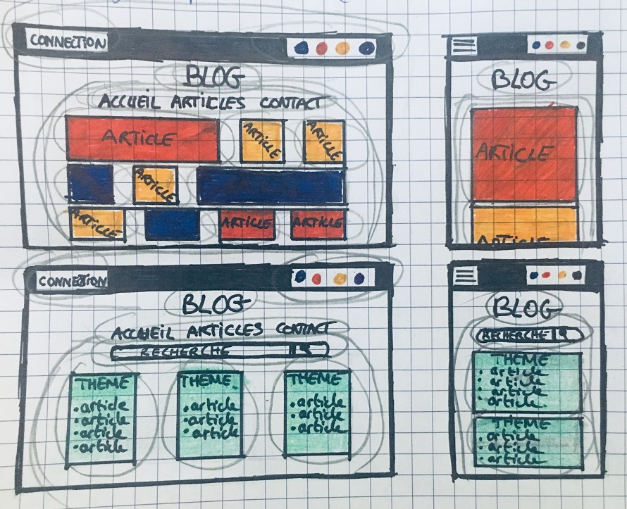
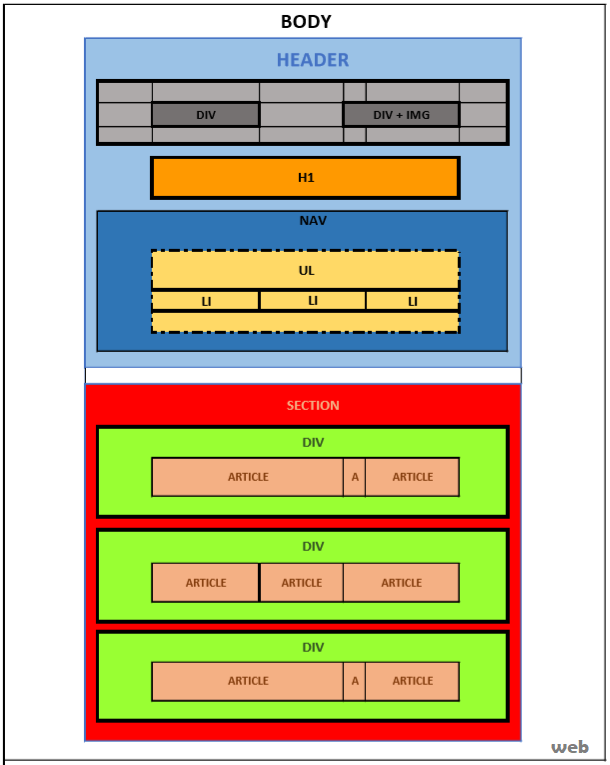
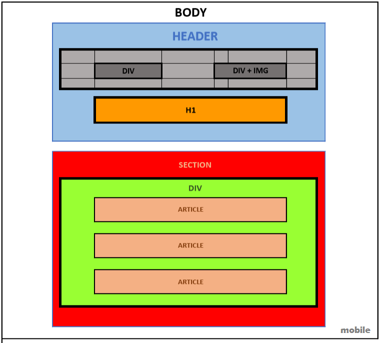

# DÉVELOPPER LA PARTIE FRONT D'UN BLOG

## CONTENU

 * 1 page d'accueil + espace connexion
 * 1 page qui regroupe les articles
 * 1 page par article (10 articles) + commentaires
 * design et technologies libres, mobile first

## CRITÈRES D'ÉVALUTATION

* maquette d'application
* interface statique (gh-page)
* dynamique du site (animation etc... )

### MES MAQUETTES

